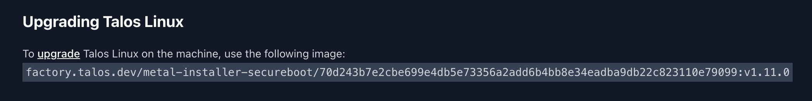


No, you don't need to re-install the OS (like I did).


## Introduction
`Talos` is a modern, lightweight (only [12 binaries!](https://www.siderolabs.com/blog/there-are-only-12-binaries-in-talos-linux/)) operating system designed with a single purpose in mind: running Kubernetes. This makes it the perfect choice for my new Kubernetes-based homelab upgrade. However, sometimes you need more than 12 binaries on your host OS, which is why Talos has [extensions](https://www.talos.dev/v1.3/talos-guides/configuration/system-extensions/). This allows you to include extra system functionality (such as gpu drivers, ssh, linux tools, etc.) to your host cluster nodes.

While the [documentation](https://www.talos.dev/v1.3/talos-guides/configuration/system-extensions/) provides a good overview of how to add extensions to the installer ISO, I had difficulty finding information on how to add extensions to an already existing and deployed cluster.

In this post I'll be showing 2 ways to add extensions to your Talos cluster (the 2nd one is better).

## Method 1: Talos Image Factory Website
When creating a new ISO, Talos provides an [Talos Image Factory](https://factory.talos.dev/) website that allows you to customize your installation ISO. However, it also provides you with the specific Docker image hash for the image it creates (which includes your extensions). To find it:

1. Go to the [Talos Image Factory](https://factory.talos.dev/) website.
2. Customize your ISO (platform, version, etc.)
3. On the System Extensions page, select all the extensions you want.
4. On the final download page, scroll down to where it says `Upgrading Talos Linux` (see below):


The Factory Image for Upgrading Talos

Save this, then jump to [Applying the New Image](#applying-the-new-image).

## Method 2: Using Curl and YAML
While the first method works, you need to search for and check the box for every System Extension you want to add. This can be tedious if you have a lot of previously-installed extensions, and could lead to trouble if you forget to add one in the new upgrade. 

Wouldn't it be great if you could track your required extensions in `git` as well?

Thankfully, the Talos Factory has an API for retrieving the image hash, including your extensions. This way you can save your extension list in `git`, and just add to it when you need to add a new one (or take one away).

1. Create a `YAML` data file (I called mine `extensions.yaml`):

```yaml
# extensions.yaml
customization:
  systemExtensions:
    officialExtensions:
      - siderolabs/iscsi-tools  # Needed for Longhorn iSCSI storage
      - siderolabs/util-linux-tools  # ZFS utilities
      - siderolabs/i915  # Intel Quicksync GPU Drivers
```

These are the extensions I (currently) use, but you'd add your own as needed from the Talos Image Factory page.

2. Run the following command to retrieve the image hash:

```bash
curl -X POST --data-binary @extensions.yaml https://factory.talos.dev/schematics
```

This will return a response that looks like:

```json
{"id":"056d8e12ba2b9711c613665c43f0ebf86eb451839a22f360a42110362f84faa1"}
```

3. Since you already installed Talos, you should have a `controlplane.yaml` file (if you don't, something is very wrong!). In this file, find your `image` link under `machine.install.image`. It should look like `image: factory.talos.dev/metal-installer-secureboot/<hash>:<version>`.

Insert your hash from above into the `controlplane.yaml` file, replacing the existing hash:

```yaml
machine:
  install:
    image: factory.talos.dev/metal-installer-secureboot/056d8e12ba2b9711c613665c43f0ebf86eb451839a22f360a42110362f84faa1:v1.10.7
```

Unfortunately, just applying this new config won't upgrade your node, since that definition is just for new installs. However, I think it's still important to add it for future installs or new nodes. To apply your new image, jump to [Applying the New Image](#applying-the-new-image).

## Applying the New Image
To upgrade your node(s) with the new images, you can use `talosctl`:

```bash
talosctl upgrade --image factor.talos.dev/metal-installer-secureboot/<hash>:<version> -n <node IP>
```

So for me, the command would look like:

```bash
talosctl upgrade --image factory.talos.dev/metal-installer-secureboot/056d8e12ba2b9711c613665c43f0ebf86eb451839a22f360a42110362f84faa1:v1.10.7 -n 10.0.2.54
```

This command will go through the upgrade process, including rebooting the node. Once it comes back, your new System Extensions will be applied! You can verify that the Extensions are loaded by running the below command:

```bash
talosctl get extensions -n 10.0.2.54
```

Which will produce this output, showing the extensions we specified:

```bash
NODE        NAMESPACE   TYPE              ID            VERSION   NAME               VERSION
10.0.2.54   runtime     ExtensionStatus   0             1         iscsi-tools        v0.2.0
10.0.2.54   runtime     ExtensionStatus   1             1         util-linux-tools   2.40.4
10.0.2.54   runtime     ExtensionStatus   2             1         i915               20250808-v1.10.7
10.0.2.54   runtime     ExtensionStatus   3             1         schematic          056d8e12ba2b9711c613665c43f0ebf86eb451839a22f360a42110362f84faa1
10.0.2.54   runtime     ExtensionStatus   modules.dep   1         modules.dep        6.12.43-talos
```

## Conclusion
As mentioned above, I prefer using the second method (the `YAML` and `curl` method) because it allows tracking the required System Extensions in `git`, making it easier to manage changes over time. This is also much easier than needing to re-install Talos with every upgrade (I maybe have done this once or twice...).

If you want to follow along with my full cluster configuration, you can check it out below:


