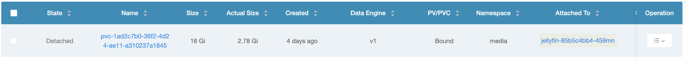
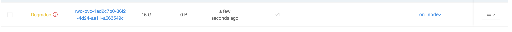


SQLite will thank you.


## Introduction
When dealing with storage for Kubernetes pods, there's three different kinds of access modes that you can assign to a volume:
- ReadWriteOnce (`RWO`): the volume can be mounted as read-write by only one node.
- ReadOnlyMany (`ROX`): the volume can be mounted as read-only by many nodes.
- ReadWriteMany (`RWX`): the volume can be mounted as read-write by many nodes.

In my cluster [Escargatoire](https://github.com/NelsonDane/escargatoire), I started out by assigning all of my volumes as `ReadWriteMany`. My thinking was I could have multiple replicas for high availability with all of them sharing the config volume. However, this approach resulted in very slow performance, particularly in apps that use a primary `SQLite` database (such as the `Starr` apps). SQLite does not handle multiple writers well, and the performance hit from using `RWX` volumes was significant.

Unfortunately there's no one-click way to convert a PVC from `RWX` to `RWO` without downtime. The process involves cloning a new `RWO` PVC and then updating the deployment to use the new PVC. I'm using [Longhorn](https://longhorn.io/) for my distributed storage, but I'm sure the process is similar for other backends.

## Converting the PVC to ReadWriteOnce
The first step is to remove the deployment for the app/service you want to change. In this example, I'll be using [Jellyfin](https://jellyfin.org/) as an example, since the only choice of backend it offers is `SQLite` (as of this writing, although great improvements towards PostgreSQL support are underway). 

First we need to delete the deployment so that Kubernetes doesn't try to use the PVC while we're working on it:

```bash
$ kubectl delete deployment -n media jellyfin
deployment.apps "jellyfin" deleted from media namespace
```

Now that the deployment has been deleted, Kubernetes won't try and recreate the pods while we're working. The next step is to edit your PVC's `.yaml` file to reflect the desired change:

```yaml {hl_lines=[8]}
apiVersion: v1
kind: PersistentVolumeClaim
metadata:
  name: jellyfin-config
  namespace: media
spec:
  accessModes:
    - ReadWriteOnce
  resources:
    requests:
      storage: 16Gi
  storageClassName: longhorn
```

Unfortunately, you can't just `kubectl apply` to change the access mode. If you could, this would be a very short article. Even if you try, you'll be greeted with a message like this:

```bash
$ k apply -k manifests/media/jellyfin
service/jellyfin unchanged
deployment.apps/jellyfin unchanged
ingress.networking.k8s.io/jellyfin-ingress unchanged
The PersistentVolumeClaim "jellyfin-config" is invalid: spec: Forbidden: spec is immutable after creation except resources.requests and volumeAttributesClassName for bound claims
@@ -1,6 +1,6 @@
 {
  "AccessModes": [
-  "ReadWriteOnce"
+  "ReadWriteMany"
  ],
  "Selector": null,
  "Resources": {
```

Instead, we need to create a "new" PVC with the desired access mode. To do this, first open up Longhorn's UI and go to the `Volumes` section.

Figure 1: Longhorn Volumes Section

You should see your existing volume list here in a `detached` state. That's because we deleted our deployment earlier, so there's no pod using the volume.


Figure 2: Detached Volume in Longhorn

To clone this volume, click on the dropdown at the end of the row and select `Clone Volume` as seen below:


Figure 3: Clone Volume Menu in Longhorn

This will open up the menu seen below:


Figure 4: Clone Volume Dialog in Longhorn

Leave everything the same, except for the `Access Mode`: Change this to `ReadWriteOnce`. **This is important!** This is the whole reason we're here. Once the volume has started cloning, you should see it in the list of volumes going from `degraded` to `detached`:


Figure 5: Degraded Cloned Volume in Longhorn


Figure 6: Detached Cloned Volume in Longhorn

This is our new volume, with the same data as before, but now in `RWO` mode. But we're not done yet. If you re-apply the existing PVC manifest, Kubernetes will still use the old volume. That's because the PVC is still bound to the old volume. To fix this, we need to update the PVC to point to the new cloned volume. We can do this from Longhorn's UI.

Open the menu of the new cloned volume and select `Create PV/PVC` as seen below:


Figure 7: Create PVC Menu in Longhorn

In this popup, fill in the values to be the exact same as your existing PVC manifest. For me, that means setting:
- The `Storage Class` to `longhorn`
- The `name` to `jellyfin-config` 
- The `namespace` to `media`. 


Figure 8: Create PVC Dialog in Longhorn

Press `OK`, then you should see that the `RWO` volume is now `bound` to the existing PVC in the correct namespace.


Figure 9: Bound PVC in Longhorn

Now we're safe to re-apply our deployment manifest:

```bash
$ kubectl apply -f manifests/media/jellyfin.yaml
deployment.apps/jellyfin created
service/jellyfin unchanged
ingress.networking.k8s.io/jellyfin-ingress unchanged
persistentvolumeclaim/jellyfin-config configured
```

Verify that the pod starts correctly, and if so, you're done!

```bash
❯ k get pods -n media                
NAME                          READY   STATUS    RESTARTS   AGE
jellyfin-86dfb496dd-kwbps     1/1     Running   0          1m
```

## Conclusion
By switching from `RWX` to `RWO`, you should see a significant performance improvement in apps that depend on SQLite (Such as Jellyfin, Radarr, Sonarr, etc.). While moving them to PostgreSQL would be ideal, that isn't always an option. This method allows you to deploy a middle-ground solution that improves performance without any data loss and (hopefully) minimal downtime.
