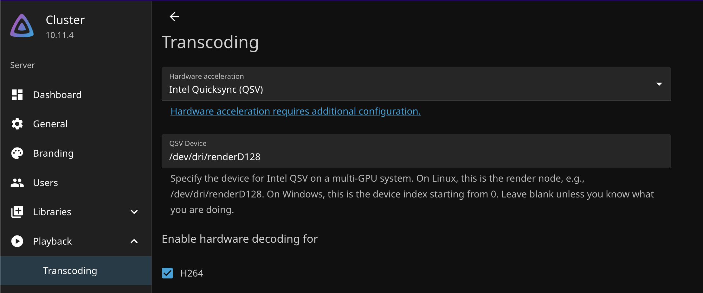

## Introduction
[`Dynamic Resource Allocation`](https://kubernetes.io/docs/concepts/scheduling-eviction/dynamic-resource-allocation/) (or `DRA`) is a new feature in Kubernetes v1.34 that allows hardware like GPUs to be exposed to pods as resources. However, on Talos Linux a few extra configuration steps are needed to set it up properly. However, this method is much easier than the old way, which required using [`device plugins`](https://docs.siderolabs.com/kubernetes-guides/advanced-guides/device-plugins).

## Pre-requisites
Kubernetes v1.34 or later is required. Make sure to upgrade Kubernetes and your Talos cluster if you haven't already. To check that `DRA` is enabled, run the following command:

```bash
$ kubectl get deviceclasses
```

If the response is `No resources found`, then you're ready to proceed.

## Install the Intel i915 Driver Extension
Instead of installing Intel drivers like on a traditional Linux distro, Talos uses [extensions](https://docs.siderolabs.com/talos/v1.9/configure-your-talos-cluster/extensions/overview) to add extra functionality to the OS. To enable Intel iGPU support, we need to install the `i915` extension on each node in the cluster. In the previous post, I went over how to do this for an existing cluster. [Read more about it here](../add_new_talos_extension/), then come back once you're done.

**Note**: If you'd like to wait to reboot the cluster, then skip the reboot step and do it after the next step.

## Patch Talos Machine Config
The next step is to patch all the nodes in the Talos cluster to change where `containerd`'s `CDI` (Container Device Interface) reads discovered hardware from. By default, it reads from `/etc/cdi`, but on Talos `/etc` is read-only (by design). To fix this, the [Talos Docs](https://docs.siderolabs.com/talos/v1.9/configure-your-talos-cluster/images-container-runtime/containerd#set-cdi-plugin-spec-dirs-to-writable-directories) require that the default path be changed to `/var/cdi`.

You can easily do that with this config patch:

```yaml {hl_lines=[7]}
machine:
  files:
  - path: /etc/cri/conf.d/20-customization.part
    op: create
    content: |
      [plugins."io.containerd.cri.v1.runtime"]
        cdi_spec_dirs = ["/var/cdi/static", "/var/cdi/dynamic"]
```

This config change instructs `containerd` to read CDI specs from `/var/cdi/static` and `/var/cdi/dynamic`, both of which are writable locations on Talos. This is important, because later we'll tell our hardware discovery tool to write to these locations instead of the default.

Then apply the path to each node in the cluster:

```bash
$ talosctl apply-config --talosconfig=./talosconfig -f controlplane.yaml -n <node ip> -e <node ip> --config-patch @nodes/node1.yaml
```
(This is the command I use to apply config patches to my nodes. I added the patch directly to my `controlplane.yaml` file for simplicity, but you can also create a separate file and apply it with `--config-patch @path/to/patch.yaml`.)

Because this file modifies `containerd`'s config, the nodes will automatically reboot to apply the changes. This can take a few minutes depending on the hardware and configured workloads. You can always check the status of your cluster with `kubectl get nodes`, and view the Talos dashboard with `talosctl dashboard -n <node ip>`.

## (Optional) Install Node Feature Discovery (NFD)
[`Node Feature Discovery`](https://github.com/kubernetes-sigs/node-feature-discovery) (or `NFD`) is a Kubernetes add-on for detecting hardware features on the cluster's physical nodes. While not necessary for DRA to work, it can be used to limit which nodes the Intel Resource Driver gets deployed to. This is useful if you have a mixed cluster with some nodes that don't have Intel iGPUs and you don't want an extra pod running on those nodes. (It can also be used for `affinity` rules in your workloads later on. It's pretty cool.)

[`The GitHub page`](https://github.com/kubernetes-sigs/node-feature-discovery) contains simple instructions to install it with `kustomize` or `helm`. Just make sure to install it into a `privileged` namespace if you're using the default Talos security context.

## Install the Intel Resource Driver
To expose the iGPUs as Kubernetes `resources`, we need to install the [`Intel GPU Resource Driver`](https://github.com/intel/intel-resource-drivers-for-kubernetes). This DaemonSet will discover Intel hardware on each node and then create the necessary `CDI` specs for `containerd` to use (from the paths we configured earlier).

I use `Flux CD` to manage my cluster's state, so all I needed to do was create a directory containing a `kustomization.yaml` file with the following content:

```yaml
apiVersion: kustomize.config.k8s.io/v1beta1
kind: Kustomization
resources:
  - helm-release.yaml
  - helm-repo.yaml
  - namespace.yaml
```

And then a `helm-repo.yaml` file to add the Intel OCI Helm repo:

```yaml
apiVersion: source.toolkit.fluxcd.io/v1
kind: HelmRepository
metadata:
  name: intel-gpu-resource-driver
  namespace: intel-gpu-resource-driver
spec:
  type: oci
  interval: 1h
  url: oci://ghcr.io/intel/intel-resource-drivers-for-kubernetes
```

Then a `helm-release.yaml` file to install the chart:

```yaml
apiVersion: helm.toolkit.fluxcd.io/v2
kind: HelmRelease
metadata:
  name: intel-gpu-resource-driver
  namespace: intel-gpu-resource-driver
spec:
  interval: 1hr # How often to check for updates
  releaseName: intel-gpu-resource-driver
  chart:
    spec:
      chart: intel-gpu-resource-driver-chart
      version: 0.9.0 # The current latest version as of this writing. You could also use "*", but it's best practice to pin to a specific version.
      sourceRef:
        kind: HelmRepository # Point to the repo we created above
        name: intel-gpu-resource-driver
        namespace: intel-gpu-resource-driver
  values:
    # Added from: https://github.com/intel/intel-resource-drivers-for-kubernetes/issues/35
    cdi:
      staticPath: /var/cdi/static # Remember the paths we set earlier? Here they are!
      dynamicPath: /var/cdi/dynamic
    nodeFeatureRules:
      enabled: true # Enable NFD integration. If you didn't install NFD, set this to false (or remove it entirely)
```

And finally a `namespace.yaml` file to create the namespace:

```yaml
apiVersion: v1
kind: Namespace
metadata:
  name: intel-gpu-resource-driver
  labels:
    pod-security.kubernetes.io/enforce: privileged
    pod-security.kubernetes.io/audit: privileged
    pod-security.kubernetes.io/warn: privileged
```

Now you can either commit this to Git and let Flux sync it, or you can manually apply it for testing with `kubectl apply -k ./path/to/intel-gpu-resource-driver/`.

After a few moments, you should see the DaemonSet and its pods created in the `intel-gpu-resource-driver` namespace:

```bash
$ kubectl get pods -n intel-gpu-resource-driver

NAME                                             READY   STATUS    RESTARTS   AGE
intel-gpu-resource-driver-kubelet-plugin-hwvbk   1/1     Running   0          1m
intel-gpu-resource-driver-kubelet-plugin-jns7x   1/1     Running   0          1m
intel-gpu-resource-driver-kubelet-plugin-q94d8   1/1     Running   0          1m
intel-gpu-resource-driver-kubelet-plugin-wgltc   1/1     Running   0          1m
```
(I have 4 nodes in my cluster, so 4 pods are running, one for each. Yes I know that's not an odd number, I'm working on it.)

To verify that the `deviceclasses` were created, run:

```bash
$ kubectl get deviceclasses

NAME            AGE
gpu.intel.com   4h28m
```
You should hopefully see that output. If you don't, then check the status of the `HelmRelease` or the `DaemonSet` pods for errors.

## Using the Intel iGPU Resource in a Pod
For this example, I'm going to use my [`Jellyfin`](https://jellyfin.org/) deployment (kind of the whole reason I wanted Intel Quicksync iGPU support in the first place haha). To use the Intel GPU resource in the pod, we need to add a `ResourceClaimTemplate`:

```yaml
apiVersion: resource.k8s.io/v1
kind: ResourceClaimTemplate
metadata:
  name: i915
  namespace: media # Same namespace as the pod
spec:
  spec:
    devices:
      requests:
      - name: i915
        exactly:
          deviceClassName: gpu.intel.com # <-- The device class from earlier!
```

Then in the pod spec, we need to reference the claim template:

```yaml {hl_lines=[11,14]}
apiVersion: apps/v1
kind: Deployment
metadata:
  name: jellyfin
  namespace: media
spec:
    spec:
      containers:
        - name: jellyfin
          image: jellyfin/jellyfin:latest
          resources:
            claims:
              - name: i915
      resourceClaims:
        - name: i915
          resourceClaimTemplateName: i915
```
**Note**: This is a stripped down version of the actual deployment manifest. I removed a lot of things like volumes, ports, security context, etc. for brevity.

Once this is applied, the pod should schedule successfully on a node container the Intel iGPU, and it will be available for use inside the container at `/dev/dri`.

To verify that the device is available inside the container, you can exec into the pod and check for the device files:

```bash
$ kubectl exec -n media -it <jellyfin-pod-name> -- ls /dev/dri
card0  renderD128
```

Then in the Jellyfin admin dashboard, configure hardware acceleration to `Intel QuickSync` and point it to the `/dev/dri/renderD128` device.



If everything worked, you should be able to play a video that requires transcoding, and see the Intel iGPU being used for hardware acceleration! Woo!

## Conclusion
Dynamic Resource Allocation makes it much easier to expose hardware to Kubernetes pods, and thankfully the switch from device plugins was (mostly) painless for me on Talos Linux. Hopefully this helps with your homelab cluster journey, and happy ~~overcomplicating everything~~ helming!

**References:**
- https://broersma.dev/talos-linux-and-dynamic-resource-allocation-beta/
- https://kubernetes.io/docs/concepts/scheduling-eviction/dynamic-resource-allocation/
